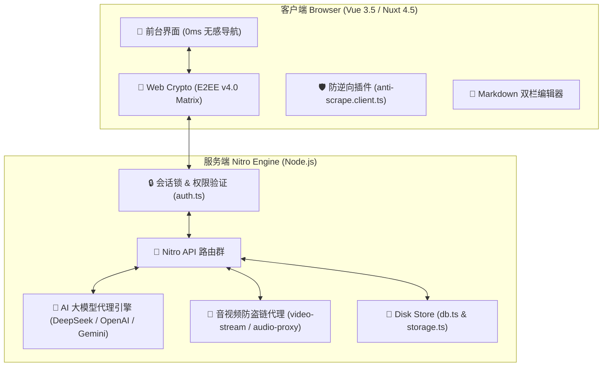
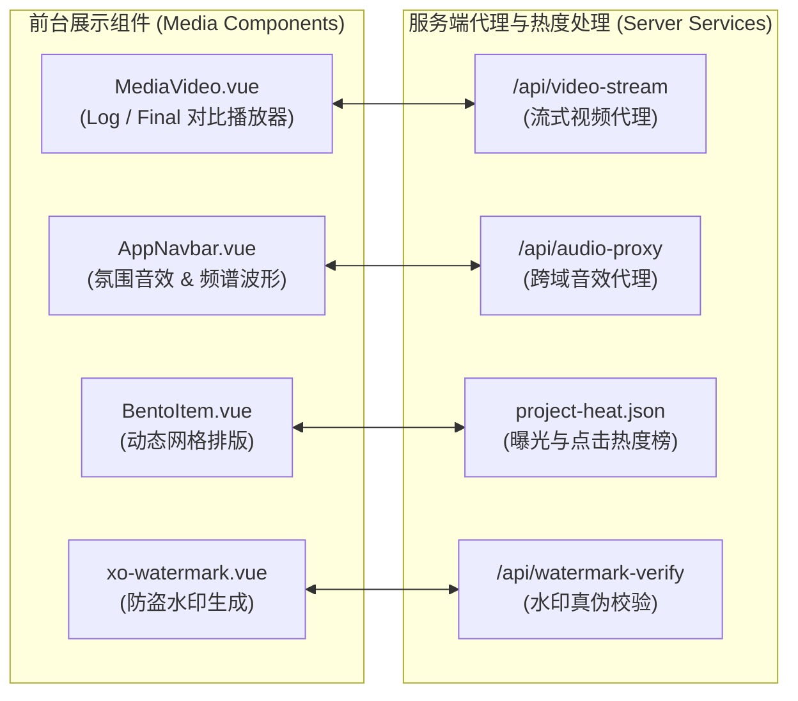
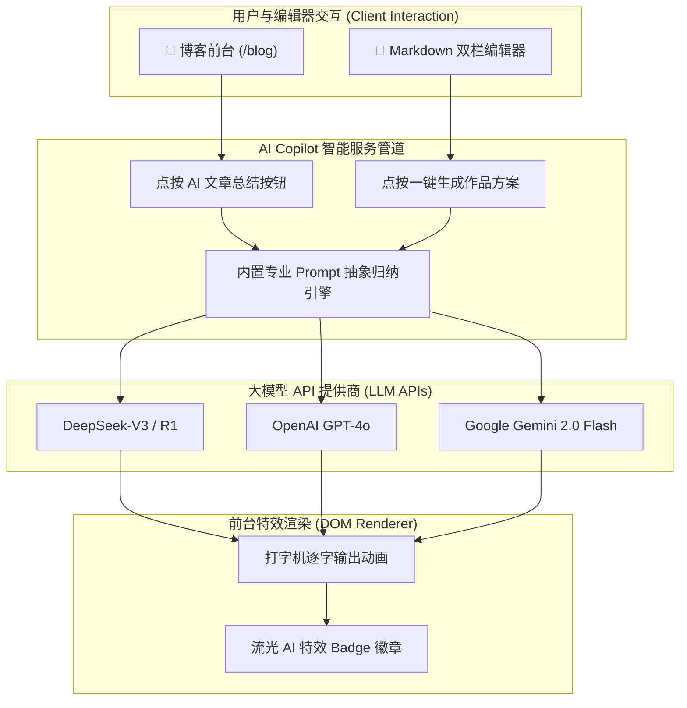
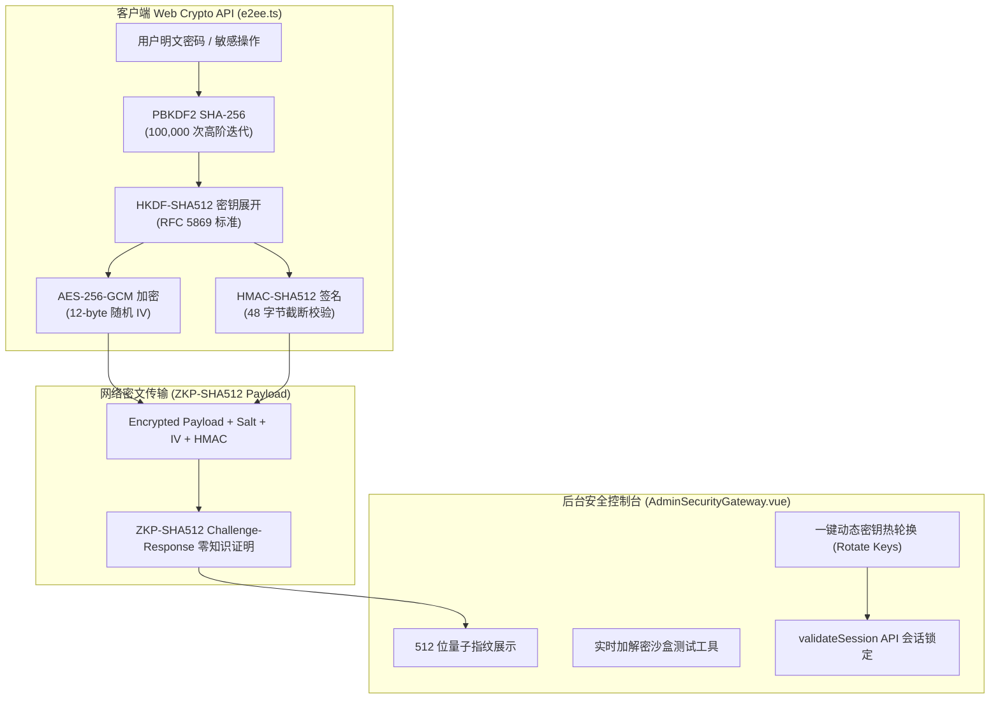
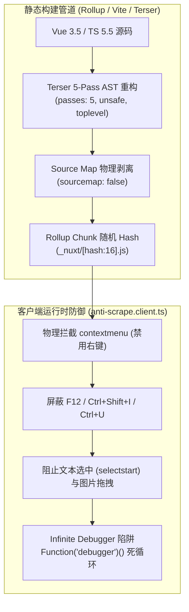
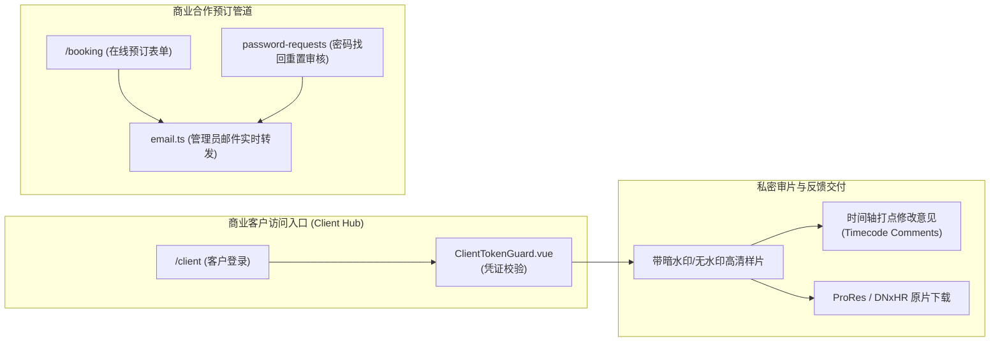
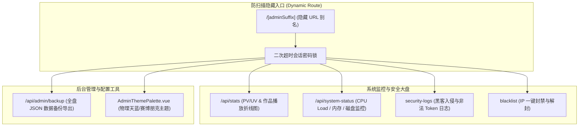
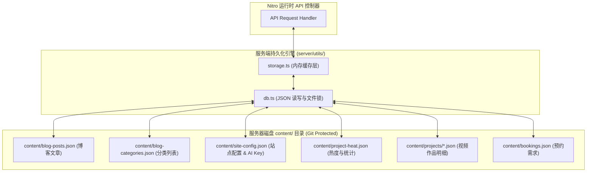
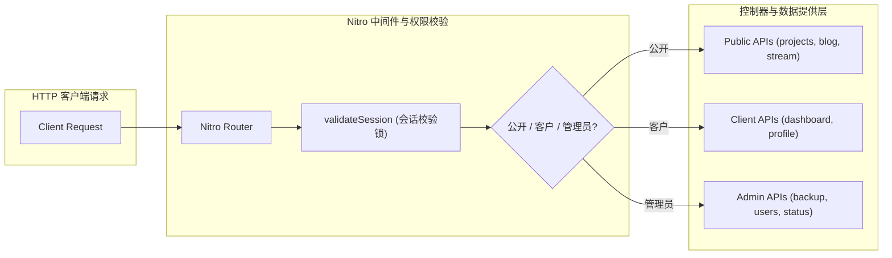
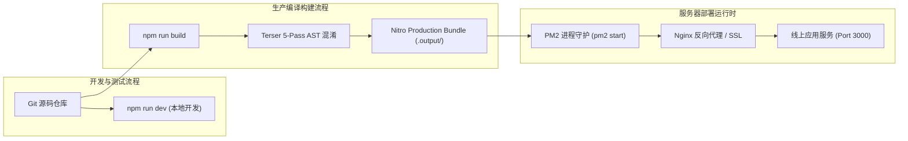

# ✨ Xo Studio & Capsule Blog — 全量功能与系统技术规范总览

> **系统版本**：v4.0 Quantum Matrix / v3.0 ULTRA  
> **面向角色**：独立视频剪辑指导、DI 调色总监、全栈创作者与高端商业工作坊  
> **核心特色**：轻奢大刊感视觉、0ms 无感路由、E2EE 零知识端到端加密、AI 大模型内容提炼、v3.0 ULTRA 前端防逆向混淆、零数据库 Server Disk 持久化

---

## 📋 目录
- [一、 📌 系统总体架构与设计哲学](#一-📌-系统总体架构与设计哲学)
- [二、 🎬 影视与 DI 调色作品集展示系统](#二-🎬-影视与-di-调色作品集展示系统)
- [三、 ✍️ 次世代胶囊博客与 AI 智能总结系统](#三-✍️-次世代胶囊博客与-ai-智能总结系统)
- [四、 🔐 E2EE v4.0 Quantum Matrix 端到端加密体系](#四-🔐-e2ee-v40-quantum-matrix-端到端加密体系)
- [五、 🛡️ v3.0 ULTRA 前端防逆向与防审查系统](#五-🛡️-v30-ultra-前端防逆向与防审查系统)
- [六、 💼 客户合作、审片交付与在线预约系统](#六-💼-客户合作审片交付与在线预约系统)
- [七、 ⚙️ 管理后台与系统监控大盘](#七-⚙️-管理后台与系统监控大盘)
- [八、 💾 免数据库 Server Disk 持久化架构](#八-💾-免数据库-server-disk-持久化架构)
- [九、 🔌 全量后端 API 接口规范手册](#九-🔌-全量后端-api-接口规范手册)
- [十、 🚀 部署、运维与环境配置指南](#十-🚀-部署运维与环境配置指南)

---

## 一、 📌 系统总体架构与设计哲学

### 1.1 技术栈全貌
- **前端核心**：Nuxt 4.5 + Vue 3.5 + TypeScript 5.5
- **样式与美学**：Tailwind CSS 3 + Vanilla CSS 微特效 + Google Fonts (Inter / Roboto)
- **后端框架**：Nuxt Nitro 引擎 / Node.js >= 18.0
- **加密协议**：W3C Web Crypto API (PBKDF2 100K / HKDF-SHA512 / AES-256-GCM / ZKP-SHA512)
- **代码混淆**：Terser 5-Pass AST 深度混淆算法 (`passes: 5`)
- **数据持久化**：Server Disk JSON 文件存储（零数据库依赖）

### 1.2 系统总体高阶架构图


---

## 二、 🎬 影视与 DI 调色作品集展示系统

### 2.1 模块高阶架构图


### 2.2 详细功能说明
- **🎞️ Log / Final 调色前后实时对比播放器 (`MediaVideo.vue`)**：原生 HTML5 Video 元素并行加载原始 Log 灰片与 Final 成片，内置视频播放时间与状态强制同步机制。可通过鼠标/触摸拖拽控制分割面比例（0% ~ 100%）。
- **🎵 氛围音效播放器 (`AppNavbar.vue` & `audio-proxy.get.ts`)**：常驻顶部导航悬浮胶囊，动态 Audio Spectrum 12 轨律动条特效，后端代理第三方音频流。
- **🎥 专业级后期技术规格面板**：展示 4K HDR、ProRes 4444 XQ、Rec.709/DCI-P3 色彩空间、分辨率 (3840x2160)、帧率 (24fps/59.94fps) 及制作人员名单。
- **🍱 Bento 动态网格排版**：自适应跨度（1x1, 2x1, 2x2），结合 `project-heat.json` 自动记载作品展现量、点击量与播放完整率。
- **💧 XO 专属防盗水印合成与校验 (`/xo-watermark`)**：自定义防盗水印样式、倾斜度、透明度合成预览与服务端签名校验。

---

## 三、 ✍️ 次世代胶囊博客与 AI 智能总结系统

### 3.1 模块高阶架构图


### 3.2 详细功能说明
- **📖 胶囊博客前台 (`/blog`)**：支持按分类 (`/blog/category/:category`) 快速切分视图，搭配 `#007AFF` 物理天蓝高光胶囊标签，自动计算全文字数与预估阅读时长。
- **🤖 AI 大模型智能总结引擎 (`/api/blog/summary.post.ts`)**：支持 DeepSeek、OpenAI、Gemini 大模型，提炼 60-100 字精炼摘要，在前台以打字机动画呈现。
- **🪄 AI 项目一键智能生成器 (`/api/admin/ai-generate-project.post.ts`)**：输入简短概念，AI 自动补全标题、技术规格、人员列表与色彩空间。
- **📝 次世代双栏 Markdown 编辑器**：包含纯编辑、实时双栏 1:1 同步对比、纯预览三大模式，支持拖拽文件上传 (`upload.post.ts`) 与封面图同步。

---

## 四、 🔐 E2EE v4.0 Quantum Matrix 端到端加密体系

### 4.1 模块高阶架构图


### 4.2 核心加密算法规范
| 加密环节 | 采用算法 | 参数配置与规范 |
| :--- | :--- | :--- |
| **密钥派生 (KDF)** | PBKDF2 | SHA-256，100,000 次高阶迭代，动态 16 字节 Salt |
| **子密钥展开** | HKDF | RFC 5869 标准，展开独立的 Encrypt Key 与 HMAC Key |
| **对称加密** | AES-256-GCM | 256 位密钥强度，12 字节随机 IV 向量，带 GCM Tag 认证 |
| **数据签名防篡改** | HMAC-SHA512 | 512 位签名长度，48 字节截断校验值 |
| **零知识身份证明** | ZKP-SHA512 | Challenge-Response 零知识证明，服务端不保存明文密码 |

---

## 五、 🛡️ v3.0 ULTRA 前端防逆向与防审查系统

### 5.1 模块高阶架构图


### 5.2 详细功能说明
- **Terser 5 轮 AST 深度重构**：配置 `passes: 5`，强力压缩控制流，变量与函数重命名为 `a`, `b`, `c` 单字符哈希。
- **Source Map 彻底关停**：物理关停生产环境 `.map` 生成。
- **物理防审查与盗用 (`anti-scrape.client.ts`)**：拦截右键 `contextmenu`，屏蔽 `F12`/`Ctrl+Shift+I` 快捷键，禁止网页拖拽与剪切板复制。
- **DevTools 卡死陷阱 (Infinite Debugger)**：高频运行 `Function("debugger")()`，开启 DevTools 即导致调试面板冻结卡死。

---

## 六、 💼 客户合作、审片交付与在线预约系统

### 6.1 模块高阶架构图


### 6.2 详细功能说明
- **🔒 客户专区与密匙审片 (`/client`)**：商业客户分发专用 Token/Password，交付专属样片，支持时间轴打点修改意见与高清原片下载。
- **📅 商业合作预订通道 (`/booking`)**：在线提交制作类型、预算区间、交期计划，自动向管理员发送实时邮件通知。
- **🔑 密码找回与审核重置工作流**：前台提交申请，管理员可在后台面板一键批准重置或驳回。

---

## 七、 ⚙️ 管理后台与系统监控大盘

### 7.1 模块高阶架构图


### 7.2 详细功能说明
- **🕵️ 自定义隐藏后台入口 (`/[adminSuffix]`)**：防扫描设计，可自由定义高强度隐藏 URL 别名，配备二次超时密码锁。
- **📊 全站流量与热度大盘 (`/api/stats`)**：全站 PV/UV 监控、播放量折线图与热度榜单。
- **🖥️ 系统健康度大盘 (`system-status.get.ts`)**：查看内存占用率、CPU Load Average、磁盘空间占用与 Node 运行时长。
- **🛡️ 黑客入侵与黑名单管理**：记载异常请求安全日志，支持恶意 IP 拉黑与全盘 JSON 数据压缩包备份。

---

## 八、 💾 免数据库 Server Disk 持久化架构

### 8.1 模块高阶架构图


### 8.2 数据结构清单
```
content/
├── blog-posts.json           # 博客文章元数据与正文
├── blog-categories.json      # 博客分类列表与映射关系
├── site-config.json          # 站点基础配置、AI Key 与后台隐藏 URL
├── project-heat.json         # 作品浏览量、播放量与热度统计
├── password-requests.json    # 密码重置申请队列
├── bookings.json             # 商业预约需求列表
├── blacklist.json            # 封禁 IP 黑名单
├── security-logs.json        # 安全入侵与审计日志
└── projects/                 # 影视作品明细 JSON 数据集合
```

---

## 九、 🔌 全量后端 API 接口规范手册

### 9.1 模块高阶架构图


### 9.2 公开接口规范 (`/api/*`)
| 接口路径 | HTTP 方法 | 功能说明 | 鉴权要求 |
| :--- | :---: | :--- | :---: |
| `/api/projects.get` | `GET` | 获取作品集列表与排序数据 | 公开 |
| `/api/blog/posts.get` | `GET` | 获取博客文章列表 | 公开 |
| `/api/blog/categories.get` | `GET` | 获取博客分类列表 | 公开 |
| `/api/blog/summary.post` | `POST` | 触发 AI 文章总结并生成摘要 | 公开 |
| `/api/video-stream.get` | `GET` | 高性能流式视频代理播放 | 公开 |
| `/api/audio-proxy.get` | `GET` | 氛围音效代理播放 | 公开 |
| `/api/watermark-verify.post` | `POST` | 防盗水印生成与验真校验 | 公开 |
| `/api/booking.post` | `POST` | 提交商业合作预约需求 | 公开 |
| `/api/password-requests.post` | `POST` | 提交密码找回申请 | 公开 |
| `/api/auth/client-login.post` | `POST` | 商业客户专区 Token 登录 | 客户凭证 |
| `/api/client/dashboard.get` | `GET` | 商业客户专属审片交付数据 | 客户 Session |

### 9.3 管理员受保护接口规范 (`/api/admin/*`)
| 接口路径 | HTTP 方法 | 功能说明 | 鉴权要求 |
| :--- | :---: | :--- | :---: |
| `/api/auth/login.post` | `POST` | 管理员主登录鉴权 | 密码 / E2EE |
| `/api/site-config` | `GET / PUT` | 获取或更新站点全局配置 | 管理员 Session |
| `/api/projects.post` | `POST` | 新建影视作品 | 管理员 Session |
| `/api/projects.put` | `PUT` | 修改影视作品 | 管理员 Session |
| `/api/projects.delete` | `DELETE` | 删除指定作品 | 管理员 Session |
| `/api/admin/reorder-projects.post` | `POST` | 拖拽保存作品自定义排序 | 管理员 Session |
| `/api/admin/ai-generate-project.post`| `POST` | 调用 AI 一键生成作品方案 | 管理员 Session |
| `/api/blog/posts.post` | `POST` | 发布新博客文章 | 管理员 Session |
| `/api/blog/posts.delete` | `DELETE` | 删除博客文章 | 管理员 Session |
| `/api/admin/active-sessions` | `GET / DELETE` | 查看/踢出当前活跃 Session | 管理员 Session |
| `/api/admin/blacklist` | `GET / POST` | 查看及封禁/解封 IP 黑名单 | 管理员 Session |
| `/api/system-status.get` | `GET` | 获取服务器 CPU/内存/磁盘健康度 | 管理员 Session |
| `/api/admin/backup` | `GET` | 下载全盘 JSON 数据备份包 | 管理员 Session |

---

## 十、 🚀 部署、运维与环境配置指南

### 10.1 模块高阶架构图


### 10.2 常用命令速查

```bash
# 1. 克隆代码仓库
git clone https://github.com/your-username/xo-studio.git
cd xo-studio

# 2. 安装项目依赖
npm install

# 3. 启动本地开发服务器 (默认端口 3000)
npm run dev

# 4. 构建生产产物 (自动触发 Terser 5-Pass 混淆与 Source Map 剥离)
npm run build

# 5. 本地预览生产构建产物
npm run preview

# 6. 使用 PM2 托管生产服务
pm2 start .output/server/index.mjs --name "xo-studio"
```

---

> **版权声明**：© 2026 Xo Studio & Capsule Blog. All Rights Reserved.
