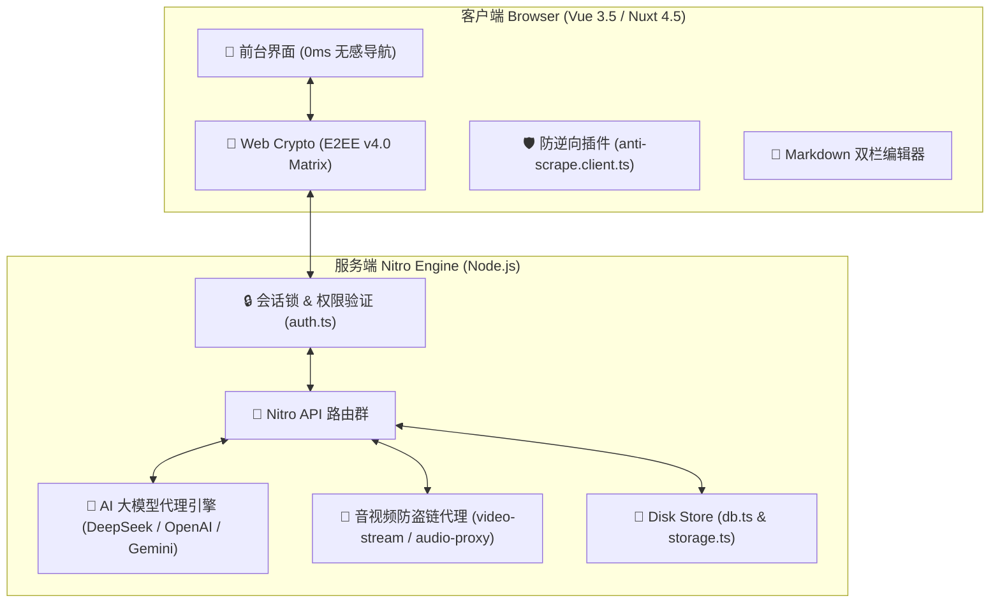

# ✨ Xo Studio & Capsule Blog — 全量功能与系统技术规范总览

> **系统版本**：v4.0 Quantum Matrix / v3.0 ULTRA  
> **面向角色**：独立视频剪辑指导、DI 调色总监、全栈创作者与高端商业工作坊  
> **核心特色**：轻奢大刊感视觉、0ms 无感路由、E2EE 零知识端到端加密、AI 大模型内容提炼、v3.0 ULTRA 前端防逆向混淆、零数据库 Server Disk 持久化

---

## 📋 目录
- [一、 📌 系统总体架构与设计哲学](#一-📌-系统总体架构与设计哲学)
- [二、 🎬 影视与 DI 调色作品集展示系统](#二-🎬-影视与-di-调色作品集展示系统)
- [三、 ✍️ 次世代胶囊博客与 AI 智能总结系统](#三-✍️-次世代胶囊博客与-ai-智能总结系统)
- [四、 🔐 E2EE v4.0 Quantum Matrix 端到端加密体系](#四-🔐-e2ee-v40-quantum-matrix-端到端加密体系)
- [五、 🛡️ v3.0 ULTRA 前端防逆向与防审查系统](#五-🛡️-v30-ultra-前端防逆向与防审查系统)
- [六、 💼 客户合作、审片交付与在线预约系统](#六-💼-客户合作审片交付与在线预约系统)
- [七、 ⚙️ 管理后台与系统监控大盘](#七-⚙️-管理后台与系统监控大盘)
- [八、 💾 免数据库 Server Disk 持久化架构](#八-💾-免数据库-server-disk-持久化架构)
- [九、 🔌 全量后端 API 接口规范手册](#九-🔌-全量后端-api-接口规范手册)
- [十、 🚀 部署、运维与环境配置指南](#十-🚀-部署运维与环境配置指南)

---

## 一、 📌 系统总体架构与设计哲学

### 1.1 技术栈全貌
- **前端核心**：Nuxt 4.5 + Vue 3.5 + TypeScript 5.5
- **样式与美学**：Tailwind CSS 3 + Vanilla CSS 微特效 + Google Fonts (Inter / Roboto)
- **后端框架**：Nuxt Nitro 引擎 / Node.js >= 18.0
- **加密协议**：W3C Web Crypto API (PBKDF2 100K / HKDF-SHA512 / AES-256-GCM / ZKP-SHA512)
- **代码混淆**：Terser 5-Pass AST 深度混淆算法 (`passes: 5`)
- **数据持久化**：Server Disk JSON 文件存储（零数据库依赖）

### 1.2 系统高阶架构图


---

## 二、 🎬 影视与 DI 调色作品集展示系统

专门针对影视剪辑指导与调色师需求开发，引入影视工业级的展示逻辑与渲染组件：

### 2.1 🎞️ Log / Final 调色前后实时对比播放器 (`MediaVideo.vue`)
- **双轨同步渲染引擎**：原生 HTML5 Video 元素并行加载原始 Log 灰片与 Final 成片，内置视频播放时间与状态强制同步机制。
- **物理滑块切割对比**：可通过鼠标/触摸拖拽控制分割面比例（0% ~ 100%），支持渐变高光分隔线条与对比度微调。
- **全屏高清审片模式**：一键进入全屏沉浸式审片，消除所有 DOM 干扰元素。

### 2.2 🎵 氛围音效播放器 (`AppNavbar.vue` & `audio-proxy.get.ts`)
- **常驻顶部导航悬浮胶囊**：点击可开启背景音效，支持自定义曲目与循环模式。
- **音频波形 (Spectrum) 可视化**：根据音频数据动态绘制 12 轨律动条特效。
- **流式防盗链代理**：通过后端 `audio-proxy.get.ts` 代理第三方音频文件，规避 CORS 限制并提供客户端缓存优化。

### 2.3 🎥 专业级后期技术规格面板
为每个作品提供详细的后期工业参数卡片：
- **格式与画质**：4K HDR / ProRes 4444 XQ / H.265 / AVC。
- **色彩空间**：Rec.709 / DCI-P3 / Rec.2020 / ARRI LogC3/LogC4。
- **制片信息**：分辨率 (3840x2160)、帧率 (24fps/59.94fps)、制作日期及全套制作人员名单（剪辑、调色、导演、DP、特效）。

### 2.4 🍱 Bento 动态网格排版 (`BentoContainer.vue` & `BentoItem.vue`)
- **模块化 Bento Grid**：智能自适应卡片跨度（1x1, 2x1, 2x2），呈现现代杂志级视觉高光。
- **热度与曝光统计**：后台自动记载作品展现量、点击量与播放完整率，按 `project-heat.json` 动态排序高热度作品。

### 2.5 💧 XO 专属防盗水印合成与校验 (`/xo-watermark` & `watermark-verify.post.ts`)
- **动态防盗水印合成**：前台提供防盗水印自定义样式、倾斜度、透明度与品牌 Logo 合成预览。
- **水印验真服务端 API**：通过校验特定密匙与时间戳算法验证作品来源合法性。

---

## 三、 ✍️ 次世代胶囊博客与 AI 智能总结系统

### 3.1 📖 胶囊博客前台 (`/blog`)
- **响应式分类与标签过滤**：支持按分类 (`/blog/category/:category`) 快速切分视图，搭配 `#007AFF` 物理天蓝高光胶囊标签。
- **美化 Markdown 渲染引擎**：支持代码高亮、Grounded 引用、Mermaid 图表、LaTeX 数学公式与 Alert 提示框。
- **阅读体验优化**：自动计算全文字数与预估阅读时长，自带 Slug 别名路径与动态 SEO Open Graph 标签。

### 3.2 🤖 AI 大模型智能总结引擎 (`/api/blog/summary.post.ts` & `AdminAiCopilot.vue`)
- **多提供商支持**：
  - **DeepSeek** (`deepseek-chat` / `deepseek-reasoner`)
  - **OpenAI** (`gpt-4o` / `gpt-4o-mini`)
  - **Google Gemini** (`gemini-1.5-pro` / `gemini-2.0-flash`)
- **精炼 Prompt 抽象归纳**：避免机械照抄前两句，自动提炼 60-100 字的高质量抽象摘要。
- **前台打字机逐字渲染**：详情页以优雅打字机动画呈现摘要，附带闪烁光标与流光 Badge 徽章。

### 3.3 🪄 AI 项目一键智能生成器 (`/api/admin/ai-generate-project.post.ts`)
- 管理员仅需输入简短的作品概念（如："一段在西藏拍摄的雪山汽车风光调色大片"）。
- AI 自动补全标题、副标题、详细文案、后期技术规格参数、制作人员列表及色彩空间建议。

### 3.4 📝 次世代双栏 Markdown 编辑器
- **三大工作视图**：
  - ✏️ **纯编辑模式**：无干扰纯文本沉浸写作。
  - ⚖️ **实时双栏对比模式**：左侧编辑源码，右侧 1:1 同步滚动预览渲染。
  - 👁️ **纯预览模式**：直观感受最终文章页面效果。
- **拖拽文件上传** (`upload.post.ts`)：支持直接拖拽图片/视频到编辑器，自动上传并插入 Markdown 语法。
- **双向封面图与头像同步**：支持外链网络图片或本地上传，自动联动个人履历头像。

---

## 四、 🔐 E2EE v4.0 Quantum Matrix 端到端加密体系

针对作品机密与敏感数据，全站内置基于 W3C 标准 Web Crypto API 的零知识加密体系：

### 4.1 加密算法与架构细节

| 加密环节 | 采用算法 | 参数配置与规范 |
| :--- | :--- | :--- |
| **密钥派生 (KDF)** | PBKDF2 | SHA-256，100,000 次高阶迭代，动态 16 字节 Salt |
| **子密钥展开** | HKDF | RFC 5869 标准，展开独立的 Encrypt Key 与 HMAC Key |
| **对称加密** | AES-256-GCM | 256 位密钥强度，12 字节随机 IV 向量，带 GCM Tag 认证 |
| **数据签名防篡改** | HMAC-SHA512 | 512 位签名长度，48 字节截断校验值 |
| **零知识身份证明** | ZKP-SHA512 | Challenge-Response 零知识证明，服务端不保存明文密码 |

### 4.2 🔐 后台 E2EE 安全控制台 (`AdminSecurityGateway.vue`)
- **512 位量子指纹展示**：直观渲染当前会话的量子安全 Hash 校验位。
- **一键动态密钥热轮换 (Key Hot-Rotation)**：在控制台点击轮换密钥后，系统即刻重新加密存量数据并强制作废旧的客户端 Session 密钥。
- **实时加解密沙盒**：支持管理员在线测试字符串加解密、校验 HMAC 签名与 IV 偏移向量。
- **Session 会话强校验**：后端全量写操作 API 注入 `validateSession` 拦截器，超时自动锁定。

---

## 五、 🛡️ v3.0 ULTRA 前端防逆向与防审查系统

针对前端静态资源与逻辑防护，实施极致的代码反编译与静态分析阻断策略：

```
源代码 (TypeScript / Vue)
    │
    ▼
[ Vite / Rollup 构建阶段 ]
    │
    ├─► Terser 5-Pass AST 混淆 (passes: 5, unsafe: true, toplevel: true)
    ├─► Source Map 物理剥离 (sourcemap: false, 移除所有调试映射)
    └─► Rollup Chunk 随机重命名 (_nuxt/[hash:16].js)
    │
    ▼
[ 客户端浏览器运行阶段 ]
    │
    ├─► 物理右键菜单屏蔽 (contextmenu 拦截)
    ├─► 防文本选中 / 防拖拽 / 防复制剪切板 (CSS user-select: none)
    └─► DevTools Infinite Debugger (高频 debugger 死循环陷阱)
```

### 5.1 详细防御策略
1. **Terser 5 轮 AST 深度重构**：配置 `passes: 5`，强力压缩控制流，变量与函数重命名为 `a`, `b`, `c` 单字符哈希。
2. **Source Map 彻底关停**：关闭生产环境 `.map` 生成，即使在 DevTools 中也只能看到压缩混淆后的混淆块。
3. **物理防审查与盗用** (`anti-scrape.client.ts`)：
   - 拦截 `contextmenu`（右键菜单）。
   - 屏蔽 `F12`、`Ctrl+Shift+I`、`Ctrl+U`、`Ctrl+S` 等快捷键。
   - 拦截 `selectstart`（禁止文本选中）与 `dragstart`（禁止图片拖拽）。
4. **DevTools 卡死陷阱 (Infinite Debugger)**：后台高频运行 `Function("debugger")()`，用户一旦试图强制开启 DevTools 检查工具，调试器将立即陷入高频无限断点死循环，强行卡死冻结浏览器标签页。

---

## 六、 💼 客户合作、审片交付与在线预约系统

### 6.1 🔒 客户专区与密匙审片 (`/client` & `ClientTokenGuard.vue`)
- **独家客户登录入口** (`/server/api/auth/client-login.post.ts`)：为特定商业客户分发专用 Token / Password。
- **私密审片面板** (`/server/api/client/dashboard.get.ts`)：
  - 交付专属无水印/带暗水印样片。
  - 客户可在线提交时间轴打点修改意见（Timecode Comments）。
  - 授权提供最高画质 ProRes / DNxHR 原片下载链接。

### 6.2 📅 商业合作预订通道 (`/booking` & `booking.post.ts`)
- **需求问卷表单**：支持选择项目类型（商业广告、音乐 MV、电影长片、短片、调色服务）、预估预算区间、期望交期。
- **自动化邮件通知** (`email.ts`)：提交数据后自动向管理员邮箱发送实时通知。

### 6.3 🔑 密码找回与审核重置工作流
- **前台提交申请** (`/api/password-requests.post.ts`)：允许忘记密码的用户/客户发起审核请求。
- **管理员安全管控**：管理员可在后台面板统一查阅申请列表 ([password-requests.get.ts](file:///d:/Git/zpj/server/api/password-requests.get.ts))，一键批准重置密码或驳回非法请求。

---

## 七、 ⚙️ 管理后台与系统监控大盘

### 7.1 🕵️ 自定义隐藏后台入口 (`/[adminSuffix]`)
- **动态 URL 别名**：防扫描设计，后台入口支持在 `site-config.json` 中配置自定义路由后缀（例如 `/[my-secret-admin]`），远离默认扫描。
- **二次会话密码锁**：离开页面一定时间后自动锁定，要求输入主密码重新解锁。

### 7.2 📊 全站流量与热度大盘 (`/api/stats`)
- **访问与播放统计**：监控全站 PV (Page Views)、UV (Unique Visitors)、作品集播放量折线图。
- **热门作品与热门文章榜单**：自动计算热度系数（结合浏览数、停留时长与分享点击）。

### 7.3 🖥️ 系统健康度大盘 ([system-status.get.ts](file:///d:/Git/zpj/server/api/system-status.get.ts))
- **内存占用率**：系统总内存、空闲内存及 Node.js 进程内存消耗。
- **CPU Load Average**：1分钟、5分钟、15分钟系统负载。
- **磁盘占用空间**：项目目录与 `content/` 数据目录大小。
- **运行时长与 Node 版本**：Node.js 进程持续运行时间与平台参数。

### 7.4 🛡️ 黑客入侵与黑名单管理
- **入侵安全日志** ([security-logs.ts](file:///d:/Git/zpj/server/api/admin/security-logs.ts))：记载所有异常请求、非法 Token 试探与鉴权失败记录。
- **IP 封禁与黑名单** ([blacklist.ts](file:///d:/Git/zpj/server/api/admin/blacklist.ts))：允许管理员一键拉黑恶意 IP 地址。
- **一键全量备份与恢复** ([backup.ts](file:///d:/Git/zpj/server/api/admin/backup.ts))：支持导出全盘 JSON 数据压缩包。

### 7.5 🎨 主题色彩控制面板 (`AdminThemePalette.vue`)
- 可实时切换高亮主题颜色（物理天蓝 `#007AFF`、赛博朋克紫 `#6366F1`、奢华极光绿 `#00DC82`）。

---

## 八、 💾 免数据库 Server Disk 持久化架构

打破传统项目需要配置 MySQL / PostgreSQL / MongoDB 的沉重依赖，全站采用零数据库 (Zero-DB) 模式，由 Nitro 服务端磁盘持久化引擎 ([db.ts](file:///d:/Git/zpj/server/utils/db.ts) & [storage.ts](file:///d:/Git/zpj/server/utils/storage.ts)) 进行原子化读写：

```
content/
├── blog-posts.json           # 博客文章元数据与正文
├── blog-categories.json      # 博客分类列表与映射关系
├── site-config.json          # 站点基础配置、AI Key 与后台隐藏 URL
├── project-heat.json         # 作品浏览量、播放量与热度统计
├── password-requests.json    # 密码重置申请队列
├── bookings.json             # 商业预约需求列表
├── blacklist.json            # 封禁 IP 黑名单
├── security-logs.json        # 安全入侵与审计日志
└── projects/                 # 影视作品明细 JSON 数据集合
```

> **持久化保障**：`content/` 目录已写入 `.gitignore`，代码更新执行 `git pull` 时**绝对不会被覆写或丢失**，保障线上生产数据安全。

---

## 九、 🔌 全量后端 API 接口规范手册

### 9.1 公开与客户端接口 (`/api/*`)

| 接口路径 | HTTP 方法 | 功能说明 | 鉴权要求 |
| :--- | :---: | :--- | :---: |
| `/api/projects.get` | `GET` | 获取作品集列表与排序数据 | 公开 |
| `/api/blog/posts.get` | `GET` | 获取博客文章列表 | 公开 |
| `/api/blog/categories.get` | `GET` | 获取博客分类列表 | 公开 |
| `/api/blog/summary.post` | `POST` | 触发 AI 文章总结并生成摘要 | 公开 |
| `/api/video-stream.get` | `GET` | 高性能流式视频代理播放 | 公开 |
| `/api/audio-proxy.get` | `GET` | 氛围音效代理播放 | 公开 |
| `/api/watermark-verify.post` | `POST` | 防盗水印生成与验真校验 | 公开 |
| `/api/booking.post` | `POST` | 提交商业合作预约需求 | 公开 |
| `/api/password-requests.post` | `POST` | 提交密码找回申请 | 公开 |
| `/api/auth/client-login.post` | `POST` | 商业客户专区 Token 登录 | 客户凭证 |
| `/api/client/dashboard.get` | `GET` | 商业客户专属审片交付数据 | 客户 Session |

### 9.2 管理员受保护接口 (`/api/admin/*`)

| 接口路径 | HTTP 方法 | 功能说明 | 鉴权要求 |
| :--- | :---: | :--- | :---: |
| `/api/auth/login.post` | `POST` | 管理员主登录鉴权 | 密码 / E2EE |
| `/api/site-config` | `GET / PUT` | 获取或更新站点全局配置 | 管理员 Session |
| `/api/projects.post` | `POST` | 新建影视作品 | 管理员 Session |
| `/api/projects.put` | `PUT` | 修改影视作品 | 管理员 Session |
| `/api/projects.delete` | `DELETE` | 删除指定作品 | 管理员 Session |
| `/api/admin/reorder-projects.post` | `POST` | 拖拽保存作品自定义排序 | 管理员 Session |
| `/api/admin/ai-generate-project.post`| `POST` | 调用 AI 一键生成作品方案 | 管理员 Session |
| `/api/blog/posts.post` | `POST` | 发布新博客文章 | 管理员 Session |
| `/api/blog/posts.delete` | `DELETE` | 删除博客文章 | 管理员 Session |
| `/api/admin/active-sessions` | `GET / DELETE` | 查看/踢出当前活跃 Session | 管理员 Session |
| `/api/admin/blacklist` | `GET / POST` | 查看及封禁/解封 IP 黑名单 | 管理员 Session |
| `/api/system-status.get` | `GET` | 获取服务器 CPU/内存/磁盘健康度 | 管理员 Session |
| `/api/admin/backup` | `GET` | 下载全盘 JSON 数据备份包 | 管理员 Session |

---

## 十、 🚀 部署、运维与环境配置指南

### 10.1 环境要求
- **Node.js**：`>= 18.0.0`
- **npm**：`>= 9.0.0`

### 10.2 常用命令速查

```bash
# 1. 克隆代码仓库
git clone https://github.com/your-username/xo-studio.git
cd xo-studio

# 2. 安装项目依赖
npm install

# 3. 启动本地开发服务器 (默认端口 3000)
npm run dev

# 4. 构建生产产物 (触发 Terser 5-Pass 混淆与 Source Map 剥离)
npm run build

# 5. 本地预览生产构建产物
npm run preview

# 6. 使用 PM2 托管生产服务
pm2 start .output/server/index.mjs --name "xo-studio"
```

---

> **版权声明**：© 2026 Xo Studio & Capsule Blog. All Rights Reserved.
