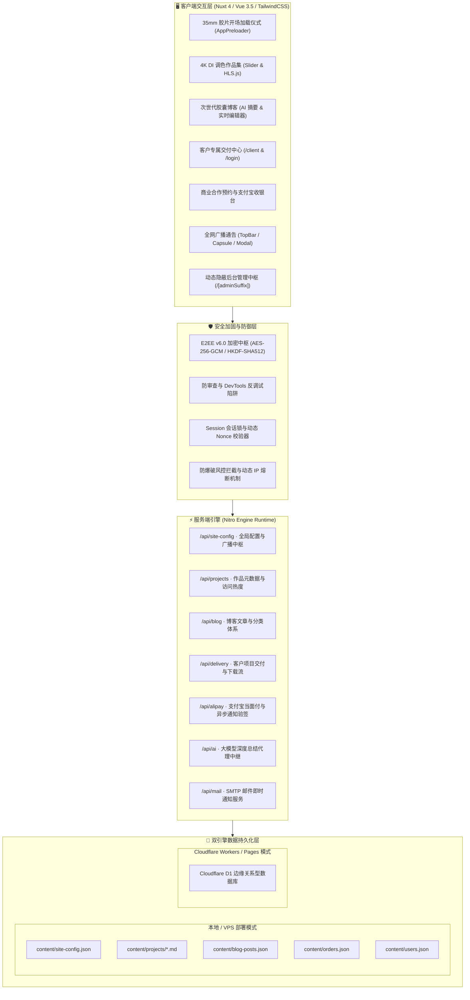
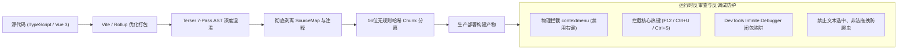

<div align="center">

# 🎬 XO STUDIO · 电影级调色与视频剪辑全流程旗舰系统

### *Next-Gen Cinema Portfolio · Capsule Editorial Blog · E2EE v6.0 AES-256-GCM · Client Delivery Suite*

<p align="center">
  
  
  
  
  
  
  
  
  
</p>

<p align="center">
  <strong>专为独立视频剪辑指导、电影 DI 调色总监与高端视觉创意工作室量身铸造的数字主场与商业交付全流程系统</strong><br>
  集 35mm 模拟胶卷开场加载仪式、Log/Rec.709 调色前后交互式对比、次世代胶囊极奢博客、AI 智能深度摘要引擎、<br>客户私密审片与加密交付库、支付宝官方收银直连、零知识端到端加密与 7 轮 AST 生产加固混淆于一体。
</p>

<p align="center">
  <a href="#-为什么选择-xo-studio">核心亮点</a> •
  <a href="#-九大核心系统矩阵">功能矩阵</a> •
  <a href="#-系统架构与拓扑图">系统架构</a> •
  <a href="#-快速上手与本地启动">快速启动</a> •
  <a href="#-生产构建与加固混淆">生产加固</a> •
  <a href="#-环境变量配置规范">环境变量</a> •
  <a href="#-动态后台管理中枢">后台控制台</a> •
  <a href="#-双引擎持久化存储与防覆写规范">数据存储</a> •
  <a href="#-工程目录全貌">目录架构</a> •
  <a href="./FEATURES.md">📖 详细功能清单</a>
</p>

---


</div>

---

## 💡 为什么选择 XO Studio？

在传统建站与作品集方案中，影视后期从业者经常面临诸如**界面缺乏质感、缺乏专业调色比对工具、原创样片易遭盗录、成片审片交付依赖网盘反复传输、缺乏线上签约收款能力**等典型业务痛点。

**XO Studio** 深度融合了**好莱坞级电影工业美学**与**现代全栈 Web 工程标准**：

1. **纯正影视工业美学**：35mm 模拟胶卷打孔带、12 叶片钛金机械光圈聚焦、SMPTE 毫秒广播时间码、母带级立体声 VU 电平表，赋予访客登堂入室的尊荣仪式感。
2. **专业调色资产展示**：原生集成 Log 灰片与 ACES/Rec.709 调色成片的**交互式平滑对比滑块**，完整呈现调色师的色彩塑造控制力。
3. **私密客户交付中心**：独立客户通行证与交付库，免除公有网盘繁杂流程，客户可在线审片、下载无损高码率商业母带。
4. **商业变现原生闭环**：内置合作排期档期日历，集成**支付宝官方当面付与快捷网页支付**，支持订金在线支付、自动验签对账与立项通知。
5. **银行级数据安全防御**：全站写操作由 **E2EE v6.0（AES-256-GCM + HKDF-SHA512 + ZKP 零知识挑战）** 护航，生产代码经过 **7 轮 AST 语法树深度混淆** 与反调试陷阱加固。
6. **双引擎自适应存储**：本地开发与单机部署使用 `content/` 独立 JSON 持久化，云原生部署支持 Cloudflare D1 边缘数据库，Git 升级拉取代码绝不覆写生产数据。

---

## 🌟 九大核心系统矩阵

<table>
<tr>
<td width="50%" valign="top">

### 🎬 1. 35mm 电影级开场加载仪式
- 🎞️ **35mm 胶片动态打孔带**：模拟左右两侧双排胶卷齿孔与柯达 Vision3 编码走带动画。
- 🌟 **2.39:1 变形宽银幕流光**：横向金青双色流光 (Anamorphic Streak) 扫过舞台中央。
- ⚙️ **12-Blade 钛金机械光圈**：精密机械叶片收缩聚焦，从梦幻大光圈虚化瞬间收至锐利中心。
- 🎨 **达芬奇色彩平衡轨道**：Lift (暗部) / Gamma (中间调) / Gain (高光) 三相轨道流动。
- ⏱️ **SMPTE 广播时间码**：微秒级动态模拟 `01:00:14:22` 逐帧高频跳跃。
- 📶 **网络真实遥测感应**：通过 Network Telemetry 动态感知 4G/5G/Wi-Fi 与往返延迟 RTT。
- 🚀 **真实资源驱动进度**：根据关键图片与字体的真实加载状态计算进度，拒绝虚假读条。
- ⏩ **毫秒快门拉幕**：支持 `ESC` / 空格键 / 点击屏幕任意位置秒级跳过入场。

</td>
<td width="50%" valign="top">

### 🎞️ 2. DI 调色对比与 4K 流媒体播放
- ⚖️ **交互式 Before / After 滑块**：丝滑滑动比对原始 Log 灰片与 Final 电影成片调色效果。
- 📺 **自适应流媒体内核**：集成原生 HTML5 视频与 `HLS.js` 扩展，支持 4K DCI、HDR 高码率平滑播放。
- 🎥 **多机位 / 多版本无缝切换**：单个作品支持多条 MP4 备选视角与多版本版本库自由切换。
- 🏷️ **影视级技术规格看板**：自动结构化呈现色彩空间（ACEScct / Rec.709）、交付格式、音频编码与主创职权。
- 🔐 **24 小时动态轮换密码**：支持完全公开、静态保护密码，以及每日 00:00 自动轮换的动态授权密码。
- 🛡️ **动态防盗录水印**：支持播放器显式动态水印与隐形版权指纹混淆，防止样片搬运盗播。

</td>
</tr>
<tr>
<td width="50%" valign="top">

### 💊 3. 次世代极奢胶囊博客 (Capsule Blog)
- 📖 **高定杂志排版系统**：采用 Quiet Luxury 胶囊美学与香槟金/高光蓝立体浮动卡片设计。
- ⏱️ **智能阅读时长计算**：基于中英文混合字频分析算法，智能输出精准阅读用时预估。
- ⚖️ **次世代实时双栏编辑器**：
  - 📝 **纯专注模式**：沉浸式专注 Markdown 撰写；
  - ⚖️ **双栏同屏模式**：左侧编辑、右侧即时渲染比对；
  - 👁️ **全景预览模式**：模拟最终读者视角的纯净展现。
- 🏷️ **动态分类胶囊与 SEO 优化**：独立 Slug 别名静态化、分类聚合筛选、文章访客打点热度统计。

</td>
<td width="50%" valign="top">

### 🤖 4. AI 智能深度摘要引擎
- 🧠 **全主流大语言模型原生支持**：后台可视化自由切换 DeepSeek、OpenAI、Gemini、Claude 或任意兼容第三方中继。
- ✍️ **专业影视视角 Prompt 调优**：专门为剪辑手记、调色案例、器材测评定制的精炼提示词，拒绝机械摘抄，自动提炼 60-100 字核心主旨。
- ⚡ **打字机律动视觉输出**：文章详情页顶部醒目 AI 胶囊面板，配合呼吸微光与渐变字形动效。
- 🗄️ **服务端智能幂等缓存**：文章生成后自动写入服务端缓存，避免重复调用浪费 API 额度。

</td>
</tr>
<tr>
<td width="50%" valign="top">

### 👑 5. 专属客户交付资源库 (Client Delivery)
- 🔑 **独立客户通行证体系**：提供独立的客户登录与控制中心通道 (`/login` & `/client`)。
- 📦 **专属项目交付空间**：按客户定制划分独立交付库，支持 4K 成片在线直审、无损分轨源文件高速下载。
- 💬 **在线审片与反馈流转**：客户可针对交付版本提交修改建议、在线确认交付验收。
- 🔒 **访问权限安全隔离**：支持专属下载密钥与时效保护，关键项目与公开作品严格隔离。
- 🛡️ **风控与防刷机制**：内置异常访问警告计数、防暴力尝试熔断与用户黑白名单管理。

</td>
<td width="50%" valign="top">

### 💳 6. 商业合作预约与支付宝支付闭环
- 📅 **合作排期档期系统**：可视化预约日历，直观呈现已锁档期与可约制作周期。
- 💰 **支付宝官方直连 SDK**：
  - 📱 **移动端**：自适应唤起支付宝快捷网页支付 / 手机客户端；
  - 💻 **桌面端**：高清动态生成当面付收款二维码。
- 🛡️ **高安全异步验签回调**：基于 RSA2 签名算法与订单状态防篡改对账机制，支付成功后自动确认订单。
- 🧾 **财务与订单中心**：可视化账单流水、订单状态实时长轮询、款项对账与订单导出。

</td>
</tr>
<tr>
<td width="50%" valign="top">

### 📢 7. 全网全场景广播公告中枢
- 🎨 **4 种高阶呈现形态**：
  - 1️⃣ **置顶流光条 (`top-bar`)**：全站顶端吸顶通告条，带平滑跑马灯与动态导航避让；
  - 2️⃣ **极奢悬浮胶囊 (`capsule`)**：左下角常驻磨砂玻璃胶囊，带呼吸光点与操作入口；
  - 3️⃣ **居中震撼弹窗 (`modal`)**：进站首屏全屏模态窗口，适合重大档期与活动宣布；
  - 4️⃣ **常驻极简晶体 (`bell`)**：用户关闭后最小化为左下角悬浮徽标，支持随时二次点击唤醒。
- 🧪 **实时所见即所得沙盒**：后台配备动态仿真模拟器，支持一键套用 5 套经典业务模板。
- 🧠 **防打扰智能记忆**：支持 24小时 / 72小时 / 每次访问等记忆策略；后台保存配置时自动清空历史关闭限制，前台立刻生效。

</td>
<td width="50%" valign="top">

### 🔐 8. 零知识端到端加密体系 (E2EE v6.0)
- 🛡️ **W3C Web Crypto 原生规范**：采用浏览器原生底层加密 API，杜绝纯纯纯 JS 软算法的安全侧信道缺陷。
- 🔑 **PBKDF2 100,000 次高阶迭代**：配合 `HKDF-SHA512`（RFC 5869）派生独立的 AES 加密与 HMAC 校验密钥。
- 📦 **AES-256-GCM + HMAC-SHA512**：采用 12 字节随机 IV 向量与 48 字节防篡改签名。
- ⚡ **ZKP-SHA512 零知识挑战矩阵**：无需向网络传输原始密码凭证即可实现绝对安全鉴权。
- ⏳ **120 秒防重放时间窗口**：校验 `epochNonce` 唯一性，全面防御中间人嗅探与网络重放攻击。

</td>
</tr>
<tr>
<td width="100%" colspan="2" valign="top">

### 🎛️ 9. 动态隐蔽后台管理中枢 (Admin Workspace)
- 🔒 **动态安全路径隐藏**：支持将默认后台路径 `/admin` 随心修改为任意隐秘路径（如 `/xo-cockpit-88`），杜绝恶意扫描。
- 👁️ **全双屏实时同屏画布**：编辑页面一键展开右侧无缝 iframe 视窗，配置更改即刻同屏对照。
- ⌨️ **全局快捷键联动**：支持 `Ctrl + S` / `Cmd + S` 随时存盘，弹窗 `ESC` 极速关闭。
- 📊 **全栈态势感知看板**：实时监视访客来源、作品点击热度 TOP 排行、系统运行时间、CPU/内存负荷与 SSL 证书状态。
- 💾 **全站资产热备份**：支持一键导出包含全站配置的 JSON 备份，并在任何时候一键导入还原。

</td>
</tr>
</table>

---

## 🏗️ 系统架构与拓扑图



---

## 🛡️ 前端混淆与生产防逆向矩阵 (v3.0 ULTRA)

为了保障创作者的核心技术资产与商业机密，XO Studio 在生产构建阶段集成了**工业级代码硬化与反审查体系**：



- **Terser 7 轮深度语法树混淆 (`passes: 7`)**：开启 `unsafe`、`toplevel`、纯函数评估消除，局部变量与函数名高强度哈希化。
- **Source Map 彻底抹除**：完全停用 `.map` 源码映射文件，生成的 JS 产物全部混淆重命名为 `_nuxt/[hash:16].js`。
- **物理禁用右键审查菜单**：全局拦截 `contextmenu`、`dragstart` 与非法文本选中，杜绝“查看源代码”与“检查元素”。
- **DevTools 动态卡死陷阱**：利用高频 `Function("debugger")()` 闭包陷入执行死循环，一旦开启开发者工具即刻冻结页面。

---

## ⚡ 快速上手与本地启动

### 运行环境准备

确保您的本地或服务器已安装：
- **Node.js** >= `18.18.0`（强烈推荐使用 LTS `20.x` 或 `22.x`）
- **npm** >= `9.0.0` 或 **pnpm** >= `8.0.0`

### 1. 克隆代码仓库

```bash
git clone https://github.com/xiaoxi303/xo.git
cd xo
```

### 2. 安装项目依赖

```bash
npm install
```

### 3. 配置环境变量

从示例文件创建本地环境变量：

```bash
cp .env.example .env
```

> **提示**：首次启动时，系统会自动执行初始化脚本创建 `content/` 目录结构与默认站点配置 `site-config.json`。

### 4. 启动本地开发服务

```bash
npm run dev
```

启动完成后，在浏览器中访问以下常用地址：
- 🌐 **前台主页**：[http://localhost:3000](http://localhost:3000)
- 🎬 **作品集页面**：[http://localhost:3000/projects](http://localhost:3000/projects)
- 📖 **次世代博客**：[http://localhost:3000/blog](http://localhost:3000/blog)
- 👑 **客户交付中心**：[http://localhost:3000/login](http://localhost:3000/login)
- ⚙️ **管理控制台**：[http://localhost:3000/admin](http://localhost:3000/admin)（默认账号：`admin` / 密码：`admin`）

---

## 📦 生产构建与加固混淆

XO Studio 提供了完善的生产构建流水线与自动化校验工具：

### 1. 标准生产构建

```bash
# 生成高压缩比的客户端 bundle 与 Nitro 服务端产物
npm run build:nuxt
```

### 2. 高强度加固构建 (Production Hardened)

```bash
# 执行完整安全构建流程（包含多轮 AST 语法树混淆与防调试植入）
npm run build
```

该构建流水线按序执行：
1. `node scripts/build-production.mjs`：Tree-shaking 优化并生成基础产物；
2. `node scripts/obfuscate-production.mjs`：执行 7-Pass 语法树混淆与变量名重构；
3. `node scripts/verify-production.mjs`：安全校验（确保无 `.map` 源码泄露、验证产物哈希）。

### 3. 本地预览生产产物

```bash
npm run preview
```

### 4. 生产环境部署 (PM2 守护进程)

```bash
# 1. 安装生产依赖
npm ci --omit=dev

# 2. 执行生产加固构建
npm run build

# 3. 使用 PM2 启动服务守护
pm2 start .output/server/index.mjs --name "xo-studio" -i max
pm2 save
```

---

## ⚙️ 环境变量配置规范

在项目根目录的 `.env` 中按需配置以下参数：

```ini
# ==============================================================================
# XO STUDIO · 核心环境参数配置表
# ==============================================================================

# 基础网络服务配置
PORT=3000
HOST=0.0.0.0

# ------------------------------------------------------------------------------
# 🔐 管理员权限与安全鉴权
# ------------------------------------------------------------------------------
# 默认管理员登录用户名
XO_ADMIN_USERNAME=admin

# 管理员密码 salted SHA-256 哈希值
# 算法实现：crypto.createHash('sha256').update('xo-studio:' + plainPassword).digest('hex')
XO_ADMIN_PASSWORD_HASH=e7d46648813b9da930ba23875e10fa26bf3d06a8a1a85ab28ee6c6150d4d91cc

# JWT 会话签名安全密钥
JWT_SECRET=your_super_strong_jwt_secret_change_me_in_prod

# E2EE 零知识端到端加密主根密钥 (建议 32 位以上高熵随机字符串)
E2EE_SECRET=your_ultra_secure_e2ee_root_key_2026_xyz

# ------------------------------------------------------------------------------
# 💳 支付宝开放平台收银参数 (选填，启用商业在线支付时填写)
# ------------------------------------------------------------------------------
ALIPAY_APP_ID=2021000000000000
ALIPAY_PRIVATE_KEY=MIIEowIBAAKCAQEA...
ALIPAY_PUBLIC_KEY=MIIBIjANBgkqhkiG9w0BAQEFAAOCAQ8A...
ALIPAY_GATEWAY=https://openapi.alipay.com/gateway.do

# ------------------------------------------------------------------------------
# 🤖 AI 智能深度摘要大模型配置 (支持 DeepSeek / OpenAI / Gemini / 任意中继端点)
# ------------------------------------------------------------------------------
AI_MODEL_PROVIDER=deepseek
AI_API_KEY=sk-xxxxxxxxxxxxxxxxxxxxxxxxxxxxxxxx
AI_API_ENDPOINT=https://api.deepseek.com/v1
AI_MODEL_NAME=deepseek-chat

# ------------------------------------------------------------------------------
# 📧 SMTP 邮件即时通知服务 (预约、订单与审片提醒)
# ------------------------------------------------------------------------------
SMTP_HOST=smtp.qq.com
SMTP_PORT=465
SMTP_SECURE=true
SMTP_USER=your_email@qq.com
SMTP_PASS=your_smtp_authorization_code
```

<details>
<summary>📋 <strong>点击查看管理员密码哈希快速生成脚本 (Node.js)</strong></summary>

```bash
node -e "const c=require('crypto');const p='your_password';console.log(c.createHash('sha256').update('xo-studio:'+p).digest('hex'));"
```

将控制台输出的 64 位字符串复制替换 `.env` 中的 `XO_ADMIN_PASSWORD_HASH` 即可。

</details>

---

## 🎛️ 动态后台管理中枢

管理后台支持在 `content/site-config.json` 或前台可视化界面中**自由定制安全访问路径**（例如由 `/admin` 更改为 `/my-studio-console`），从根本上避免默认路由被扫描探测。

<div align="center">

| 核心模块 | 功能标签页 | 管控能力概览 |
|:---:|:---|:---|
| **📊 核心中枢** | 📈 数据看板 | 全站真实 PV / UV 监控、作品热度趋势、访客地理与设备分布、服务器负载状态 |
| | 📢 广播公告 | 置顶流光条、悬浮胶囊、居中模态、常驻挂件 4 种形态自由发布与轮播 |
| | 🧾 订单管理 | 支付宝付款交易记录、订单流水状态轮询、对账与退款状态 |
| | 📦 专属交付 | 客户交付项目库管理、无损下载链接、审片权限与批注对接 |
| **🎨 内容创作** | 🎬 作品管理 | 4K 视频直链、Before/After 调色对比图配置、技术规格标签、海报大字编号 |
| | ✍️ 博客文章 | 实时双栏编辑器、AI 深度摘要一键生成、智能阅读时长运算 |
| | 🏠 首页配置 | Slogan 大刊标语、Hero 视频背景、主推作品与数据徽章定制 |
| | 👤 个人履历 | 经历时间轴、技术栈熟练度雷达、教育与主创获奖经历 |
| **💼 商业运营** | 📅 合作预约 | 预约日历排期档期管控、合作咨询意向管理与流转邮件提醒 |
| | 🔑 授权申请 | 密码访问保护、私密作品查看申请流转与审核批准 |
| | 👥 用户管理 | 注册客户档案、交付访问权限白名单配置与黑名单防刷拦截 |
| | 💳 支付宝配置 | 开放平台 AppID、商户私钥、公钥与沙箱测试通道管理 |
| **⚙️ 系统基座** | 🌐 站点信息 | 品牌名称、SEO TDK 元数据、联系邮箱、微信与社交主页链接 |
| | 🔒 水印设置 | 播放器动态显式水印、隐形版权数字防盗印章开关 |
| | 🛠️ 高级设置 | 动态后台路径别名变更、AES 密钥热轮换、全站备份还原与会话注销 |

</div>

### ⌨️ 高频快捷操作指南
- `Ctrl + S` / `Cmd + S`：全局即时保存配置，无需在长页面中寻找保存按钮。
- `👁️ 双屏实时预览`：在后台编辑界面一键展开右侧无缝 iframe 视窗，配置更改即刻同屏对照。
- `ESC`：在任意页面秒级跳过开场动画；在弹窗状态下一键退出。

---

## 💾 双引擎持久化存储与防覆写规范

为确保在进行代码版本升级 (`git pull`) 时**绝对不覆写您的生产运营数据**，XO Studio 严格执行了**代码与数据物理解耦**架构：

```
                    ┌──────────────────────────────┐
                    │      Nitro Server Runtime    │
                    └──────────────┬───────────────┘
                                   │
              ┌────────────────────┴────────────────────┐
              ▼                                         ▼
   【本地 / VPS 磁盘模式】                   【Cloudflare 边缘模式】
   content/site-config.json                  Cloudflare D1 边缘关系型表
   content/projects/*.md                     projects 表 / site_config 表
   content/blog-posts.json                   users 表 / orders 表
   content/users.json                        password_requests 表
```

1. **核心持久化文件保存在 `content/` 独立目录**：
   - `content/site-config.json`：全站配置、SEO TDK、大模型秘钥；
   - `content/blog-posts.json` & `content/blog-categories.json`：博客全部内容；
   - `content/projects/*.md`：影视作品集、规格参数及对比图；
   - `content/orders.json` & `content/users.json`：财务订单与客户私密数据。
2. **Git 仓库防护**：`.gitignore` 已预设严格排除规则，拉取上游新代码时，已有生产数据与本地密钥零受损、零冲突。
3. **数据一键迁移与冷备**：控制台提供一键导出 `xo-studio-backup-*.json`，可随时迁移至新服务器或回滚历史快照。

---

## 📁 工程目录全貌

```
xo-studio/
├── app/                              # 前端核心应用目录
│   ├── assets/                       # 字体、全局样式与动效规则
│   ├── components/                   # 高复用 Vue 3 业务与基础组件
│   │   ├── AppPreloader.vue          # 🎬 35mm 胶片开场加载仪式组件
│   │   ├── AppNavbar.vue             # 顶栏导航与动态胶囊菜单
│   │   ├── AppFooter.vue             # 极奢页脚与版权信息
│   │   ├── AdminAnnouncementSandbox.vue # 📢 实时仿真广播公告沙盒
│   │   ├── BentoContainer.vue        # 动态 Bento 网格系统容器
│   │   ├── BentoItem.vue             # Bento 网格子单元
│   │   ├── IconSax.vue               # 矢量微动线性图标库
│   │   ├── AdminToast.vue            # 后台非打扰式 Toast 提示组件
│   │   └── AdminSecurityGateway.vue  # E2EE 安全沙盒与认证网关
│   ├── layouts/                      # 页面布局模板
│   │   └── default.vue               # 全局主布局 (Preloader / Banner / Orbs / BGM)
│   ├── pages/                        # 路由页面驱动目录
│   │   ├── index.vue                 # 🏠 视觉旗舰首页
│   │   ├── [adminSuffix]/            # ⚙️ 动态别名后台控制台中枢
│   │   ├── blog/                     # 📖 次世代胶囊博客
│   │   │   ├── index.vue             # 博客主列表页
│   │   │   ├── [slug].vue            # 文章详情页 (带 AI 智能打字机总结)
│   │   │   └── category/[category].vue
│   │   ├── projects/                 # 🎬 影视作品集
│   │   │   ├── index.vue             # 作品瀑布流与技术规格检索
│   │   │   └── [slug].vue            # 作品详情与 Before/After 调色对比滑块
│   │   ├── client/                   # 👑 专属客户交付资源库与审片中心
│   │   ├── login.vue                 # 客户通行证登录鉴权
│   │   ├── about.vue                 # 个人履历与电影哲学理念
│   │   ├── booking.vue               # 合作排期与意向登记
│   │   └── payment/                  # 💳 支付宝收银台与结果确认页
│   ├── plugins/                      # 客户端插件 (anti-scrape.client.ts 等)
│   └── utils/                        # 核心工具库 (E2EE v6.0 加密、BlogData、格式化工具)
├── content/                          # 磁盘数据持久化目录 (已配置 .gitignore，升级不丢失)
│   ├── site-config.json              # 全站动态配置与大模型参数
│   ├── blog-posts.json               # 博客文章数据全量持久化
│   ├── blog-categories.json          # 博客分类系统
│   ├── project-heat.json             # 真实访问与热度打点数据
│   ├── users.json                    # 客户账号与权限配置
│   ├── orders.json                   # 商业合作订单记录
│   └── projects/                     # 作品元数据独立 Markdown / YAML
├── server/                           # Nitro 现代化后端运行时
│   ├── api/                          # RESTful API 接口群
│   │   ├── site-config.ts            # 站点配置读写与安全脱敏
│   │   ├── projects.*.ts             # 作品流管理
│   │   ├── blog.*.ts                 # 博客 CRUD
│   │   ├── delivery.*.ts             # 客户专属交付库权限分发
│   │   ├── alipay/                   # 支付宝当面付与异步通知验签
│   │   ├── ai/                       # 大模型智能总结调用中继
│   │   └── auth/                     # 安全会话、哈希校验与 ZKP 挑战
│   └── utils/                        # 服务端密码学工具、邮件发送、磁盘/D1 IO
├── scripts/                          # 生产构建与代码加固脚本集
│   ├── build-production.mjs          # 生产优化构建流
│   ├── obfuscate-production.mjs      # 7-Pass AST 语法树深度混淆器
│   └── verify-production.mjs         # 生产产物安全性与零泄露验证
├── public/                           # 静态公开资源 (Logo, 35mm 纹理, 字体, BGM)
├── nuxt.config.ts                    # Nuxt 核心工程配置文件
├── package.json                      # 项目包管理与依赖描述
└── README.md                         # 项目核心技术文档
```

---

## ❓ 常见问题与排错指引 (FAQ)

<details>
<summary><strong>Q1: 修改了全站公告或前台配置，为什么前台刷新后没有立即显示？</strong></summary>

- **原因**：之前可能在浏览器中点击过关闭公告按钮，本地 `localStorage` 记录了 24 小时抑制标记；
- **解决方式**：在后台「全站广播公告与弹窗系统」面板底部，点击 **「🔄 重置前台关闭记录」** 按钮，或在后台点击一次「💾 保存广播配置」，系统将自动清除关闭抑制缓存并立即展示最新内容。
</details>

<details>
<summary><strong>Q2: 怎样修改后台访问路径以提高安全性？</strong></summary>

- **操作步骤**：登录管理后台后，进入「高级设置」或直接在 `content/site-config.json` 中修改 `admin.adminPath` 为您的私有路径（例如 `studio-x`）。保存后，原有 `/admin` 路径将失效，必须通过 `http://your-domain.com/studio-x` 访问。
</details>

<details>
<summary><strong>Q3: 生产部署时，如何防止源码和调色参数泄露？</strong></summary>

- **建议方案**：使用 `npm run build` 命令进行加固构建。该脚本会自动剥离一切 `.map` 源码映射文件，并对全部客户端逻辑执行 7-Pass 语法树混淆与函数变量名重构，同时运行时开启反调试闭包，充分保障知识产权。
</details>

---

## 🗺️ 发展路线图 (Roadmap)

- [x] **v1.0**：Nuxt 4 全栈重构与 4K 作品集系统
- [x] **v2.0**：交互式 Log/Rec.709 调色前后滑块对比器
- [x] **v3.0**：次世代极奢胶囊博客与双栏实时编辑器
- [x] **v4.0**：DeepSeek / OpenAI 大模型智能深度精炼摘要引擎
- [x] **v5.0**：E2EE v6.0 零知识端到端加密与防审查反调试加固
- [x] **v5.5**：支付宝官方当面付与快捷收银 SDK 直连
- [x] **v6.0**：35mm 模拟胶卷开场加载仪式与 12 叶片机械光圈重构
- [x] **v6.2**：全场景广播通告系统（置顶条 / 悬浮胶囊 / 模态弹窗 / 常驻挂件）
- [ ] **v6.5 (In Progress)**：客户在线批注时间码实时打点审片播放器
- [ ] **v7.0 (Planned)**：基于 WebGPU 的客户端实时 3D-LUT 胶片色彩滤镜模拟渲染引擎

---

## 📄 开源许可与版权声明

本项目基于 [MIT License](./LICENSE) 协议开源。

- 🎬 **Design & Creative Direction**：由 **XO STUDIO**（曾培杰）原创研发与视觉指导。
- ⚡ **Powered By**：[Nuxt](https://nuxt.com/) · [Vue.js](https://vuejs.org/) · [Tailwind CSS](https://tailwindcss.com/) · [GSAP](https://greensock.com/) · [Nitro](https://nitro.unjs.io/)。

---

<div align="center">
  <p><strong>让剪辑重塑时间，与光影故事</strong></p>
  <p>Copyright © 2026 XO STUDIO (曾培杰). All Rights Reserved.</p>
</div>
